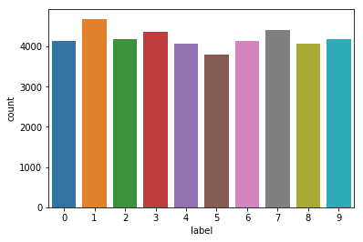
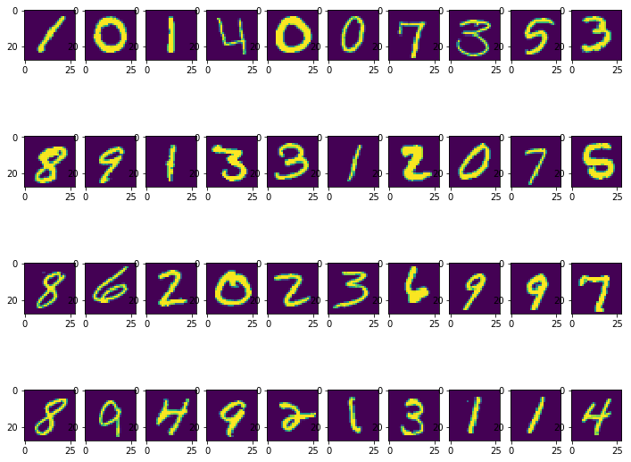
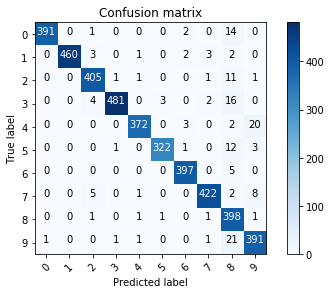
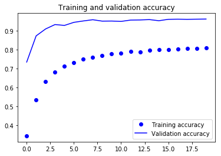
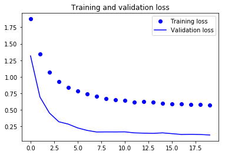
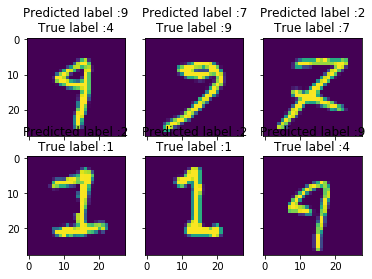
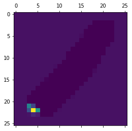

# Gahan Saraiya (18MCEC10)
---

# AIM: Image Classification in 10 Minutes with MNIST Dataset
---

References
- https://www.python-course.eu/neural_network_mnist.php
- https://medium.com/@mjbhobe/mnist-digits-classification-with-keras-ed6c2374bd0e
- https://towardsdatascience.com/image-classification-in-10-minutes-with-mnist-dataset-54c35b77a38d
- https://www.kaggle.com/adityaecdrid/mnist-with-keras-for-beginners-99457/notebook


```python
import numpy as np # linear algebra
import pandas as pd # data processing, CSV file I/O (e.g. pd.read_csv)
import matplotlib.pyplot as plt #for plotting
from collections import Counter
from sklearn.metrics import confusion_matrix
import itertools
import seaborn as sns
from subprocess import check_output
import os
# print(check_output(["ls", "input"]).decode("utf8"))
%matplotlib inline
```


```python
#loading the dataset.......(Train)
train = pd.read_csv(os.path.join("input", "train.csv"))
print(train.shape)
train.head()
```

    (42000, 785)


<div>
<style scoped>
    .dataframe tbody tr th:only-of-type {
        vertical-align: middle;
    }

    .dataframe tbody tr th {
        vertical-align: top;
    }

    .dataframe thead th {
        text-align: right;
    }
</style>
<table border="1" class="dataframe">
  <thead>
    <tr style="text-align: right;">
      <th></th>
      <th>label</th>
      <th>pixel0</th>
      <th>pixel1</th>
      <th>pixel2</th>
      <th>pixel3</th>
      <th>pixel4</th>
      <th>pixel5</th>
      <th>pixel6</th>
      <th>pixel7</th>
      <th>pixel8</th>
      <th>...</th>
      <th>pixel774</th>
      <th>pixel775</th>
      <th>pixel776</th>
      <th>pixel777</th>
      <th>pixel778</th>
      <th>pixel779</th>
      <th>pixel780</th>
      <th>pixel781</th>
      <th>pixel782</th>
      <th>pixel783</th>
    </tr>
  </thead>
  <tbody>
    <tr>
      <th>0</th>
      <td>1</td>
      <td>0</td>
      <td>0</td>
      <td>0</td>
      <td>0</td>
      <td>0</td>
      <td>0</td>
      <td>0</td>
      <td>0</td>
      <td>0</td>
      <td>...</td>
      <td>0</td>
      <td>0</td>
      <td>0</td>
      <td>0</td>
      <td>0</td>
      <td>0</td>
      <td>0</td>
      <td>0</td>
      <td>0</td>
      <td>0</td>
    </tr>
    <tr>
      <th>1</th>
      <td>0</td>
      <td>0</td>
      <td>0</td>
      <td>0</td>
      <td>0</td>
      <td>0</td>
      <td>0</td>
      <td>0</td>
      <td>0</td>
      <td>0</td>
      <td>...</td>
      <td>0</td>
      <td>0</td>
      <td>0</td>
      <td>0</td>
      <td>0</td>
      <td>0</td>
      <td>0</td>
      <td>0</td>
      <td>0</td>
      <td>0</td>
    </tr>
    <tr>
      <th>2</th>
      <td>1</td>
      <td>0</td>
      <td>0</td>
      <td>0</td>
      <td>0</td>
      <td>0</td>
      <td>0</td>
      <td>0</td>
      <td>0</td>
      <td>0</td>
      <td>...</td>
      <td>0</td>
      <td>0</td>
      <td>0</td>
      <td>0</td>
      <td>0</td>
      <td>0</td>
      <td>0</td>
      <td>0</td>
      <td>0</td>
      <td>0</td>
    </tr>
    <tr>
      <th>3</th>
      <td>4</td>
      <td>0</td>
      <td>0</td>
      <td>0</td>
      <td>0</td>
      <td>0</td>
      <td>0</td>
      <td>0</td>
      <td>0</td>
      <td>0</td>
      <td>...</td>
      <td>0</td>
      <td>0</td>
      <td>0</td>
      <td>0</td>
      <td>0</td>
      <td>0</td>
      <td>0</td>
      <td>0</td>
      <td>0</td>
      <td>0</td>
    </tr>
    <tr>
      <th>4</th>
      <td>0</td>
      <td>0</td>
      <td>0</td>
      <td>0</td>
      <td>0</td>
      <td>0</td>
      <td>0</td>
      <td>0</td>
      <td>0</td>
      <td>0</td>
      <td>...</td>
      <td>0</td>
      <td>0</td>
      <td>0</td>
      <td>0</td>
      <td>0</td>
      <td>0</td>
      <td>0</td>
      <td>0</td>
      <td>0</td>
      <td>0</td>
    </tr>
  </tbody>
</table>
<p>5 rows × 785 columns</p>
</div>


```python
z_train = Counter(train['label'])
z_train
```


    Counter({0: 4132,
             1: 4684,
             2: 4177,
             3: 4351,
             4: 4072,
             5: 3795,
             6: 4137,
             7: 4401,
             8: 4063,
             9: 4188})


```python
sns.countplot(train['label'])
```


    <matplotlib.axes._subplots.AxesSubplot at 0x7f6d23f0e860>





```python
#loading the dataset.......(Test)
test= pd.read_csv("input/test.csv")
print(test.shape)
test.head()
```

    (28000, 784)


<div>
<style scoped>
    .dataframe tbody tr th:only-of-type {
        vertical-align: middle;
    }

    .dataframe tbody tr th {
        vertical-align: top;
    }

    .dataframe thead th {
        text-align: right;
    }
</style>
<table border="1" class="dataframe">
  <thead>
    <tr style="text-align: right;">
      <th></th>
      <th>pixel0</th>
      <th>pixel1</th>
      <th>pixel2</th>
      <th>pixel3</th>
      <th>pixel4</th>
      <th>pixel5</th>
      <th>pixel6</th>
      <th>pixel7</th>
      <th>pixel8</th>
      <th>pixel9</th>
      <th>...</th>
      <th>pixel774</th>
      <th>pixel775</th>
      <th>pixel776</th>
      <th>pixel777</th>
      <th>pixel778</th>
      <th>pixel779</th>
      <th>pixel780</th>
      <th>pixel781</th>
      <th>pixel782</th>
      <th>pixel783</th>
    </tr>
  </thead>
  <tbody>
    <tr>
      <th>0</th>
      <td>0</td>
      <td>0</td>
      <td>0</td>
      <td>0</td>
      <td>0</td>
      <td>0</td>
      <td>0</td>
      <td>0</td>
      <td>0</td>
      <td>0</td>
      <td>...</td>
      <td>0</td>
      <td>0</td>
      <td>0</td>
      <td>0</td>
      <td>0</td>
      <td>0</td>
      <td>0</td>
      <td>0</td>
      <td>0</td>
      <td>0</td>
    </tr>
    <tr>
      <th>1</th>
      <td>0</td>
      <td>0</td>
      <td>0</td>
      <td>0</td>
      <td>0</td>
      <td>0</td>
      <td>0</td>
      <td>0</td>
      <td>0</td>
      <td>0</td>
      <td>...</td>
      <td>0</td>
      <td>0</td>
      <td>0</td>
      <td>0</td>
      <td>0</td>
      <td>0</td>
      <td>0</td>
      <td>0</td>
      <td>0</td>
      <td>0</td>
    </tr>
    <tr>
      <th>2</th>
      <td>0</td>
      <td>0</td>
      <td>0</td>
      <td>0</td>
      <td>0</td>
      <td>0</td>
      <td>0</td>
      <td>0</td>
      <td>0</td>
      <td>0</td>
      <td>...</td>
      <td>0</td>
      <td>0</td>
      <td>0</td>
      <td>0</td>
      <td>0</td>
      <td>0</td>
      <td>0</td>
      <td>0</td>
      <td>0</td>
      <td>0</td>
    </tr>
    <tr>
      <th>3</th>
      <td>0</td>
      <td>0</td>
      <td>0</td>
      <td>0</td>
      <td>0</td>
      <td>0</td>
      <td>0</td>
      <td>0</td>
      <td>0</td>
      <td>0</td>
      <td>...</td>
      <td>0</td>
      <td>0</td>
      <td>0</td>
      <td>0</td>
      <td>0</td>
      <td>0</td>
      <td>0</td>
      <td>0</td>
      <td>0</td>
      <td>0</td>
    </tr>
    <tr>
      <th>4</th>
      <td>0</td>
      <td>0</td>
      <td>0</td>
      <td>0</td>
      <td>0</td>
      <td>0</td>
      <td>0</td>
      <td>0</td>
      <td>0</td>
      <td>0</td>
      <td>...</td>
      <td>0</td>
      <td>0</td>
      <td>0</td>
      <td>0</td>
      <td>0</td>
      <td>0</td>
      <td>0</td>
      <td>0</td>
      <td>0</td>
      <td>0</td>
    </tr>
  </tbody>
</table>
<p>5 rows × 784 columns</p>
</div>


```python
x_train = (train.iloc[:,1:].values).astype('float32') # all pixel values
y_train = train.iloc[:,0].values.astype('int32') # only labels i.e targets digits
x_test = test.values.astype('float32')
```


```python
# preview the images first
plt.figure(figsize=(12,10))
x, y = 10, 4
for i in range(40):  
    plt.subplot(y, x, i+1)
    plt.imshow(x_train[i].reshape((28,28)),interpolation='nearest')
plt.show()
```





## Normalizing Data


```python
x_train = x_train/255.0
x_test = x_test/255.0
```


```python
y_train
```


    array([1, 0, 1, ..., 7, 6, 9], dtype=int32)


# Reshaping for Keras


```python
X_train = x_train.reshape(x_train.shape[0], 28, 28,1)
X_test = x_test.reshape(x_test.shape[0], 28, 28,1)
```


```python
import keras
from keras.models import Sequential
from keras.layers import Dense, Dropout, Flatten, Conv2D, MaxPool2D
from keras.layers.normalization import BatchNormalization
from keras.preprocessing.image import ImageDataGenerator
from keras.callbacks import ReduceLROnPlateau
from sklearn.model_selection import train_test_split
batch_size = 64
num_classes = 10
epochs = 20
input_shape = (28, 28, 1)
```

    Using TensorFlow backend.


```python
# convert class vectors to binary class matrices One Hot Encoding
y_train = keras.utils.to_categorical(y_train, num_classes)
X_train, X_val, Y_train, Y_val = train_test_split(X_train, y_train, test_size = 0.1, random_state=42)
```


```python
model = Sequential()
model.add(Conv2D(32, kernel_size=(3, 3),activation='relu',kernel_initializer='he_normal',input_shape=input_shape))
# model.add(Conv2D(32, kernel_size=(3, 3),activation='relu',kernel_initializer='he_normal'))
model.add(MaxPool2D((2, 2)))
model.add(Dropout(0.40))
model.add(Conv2D(8, (2, 2), activation='relu',padding='same',kernel_initializer='he_normal'))
# model.add(Conv2D(64, (3, 3), activation='relu',padding='same',kernel_initializer='he_normal'))
# model.add(Conv2D(64, (3, 3), activation='relu',padding='same',kernel_initializer='he_normal'))
model.add(MaxPool2D(pool_size=(2, 2)))
model.add(Dropout(0.5))
model.add(Conv2D(128, (3, 3), activation='relu',padding='same',kernel_initializer='he_normal'))
model.add(Dropout(0.5))
model.add(Flatten())
model.add(Dense(16, activation='relu'))
model.add(BatchNormalization())
model.add(Dropout(0.5))
model.add(Dense(num_classes, activation='softmax'))

model.compile(loss=keras.losses.categorical_crossentropy,
              optimizer=keras.optimizers.RMSprop(),
              metrics=['accuracy'])

learning_rate_reduction = ReduceLROnPlateau(monitor='val_acc', 
                                            patience=3, 
                                            verbose=1, 
                                            factor=0.5, 
                                            min_lr=0.0001)

datagen = ImageDataGenerator(
        featurewise_center=False,  # set input mean to 0 over the dataset
        samplewise_center=False,  # set each sample mean to 0
        featurewise_std_normalization=False,  # divide inputs by std of the dataset
        samplewise_std_normalization=False,  # divide each input by its std
        zca_whitening=False,  # apply ZCA whitening
        rotation_range=15, # randomly rotate images in the range (degrees, 0 to 180)
        zoom_range = 0.1, # Randomly zoom image 
        width_shift_range=0.1,  # randomly shift images horizontally (fraction of total width)
        height_shift_range=0.1,  # randomly shift images vertically (fraction of total height)
        horizontal_flip=False,  # randomly flip images
        vertical_flip=False)  # randomly flip images
```


```python
model.summary()
```

    _________________________________________________________________
    Layer (type)                 Output Shape              Param #   
    =================================================================
    conv2d_9 (Conv2D)            (None, 26, 26, 32)        320       
    _________________________________________________________________
    max_pooling2d_5 (MaxPooling2 (None, 13, 13, 32)        0         
    _________________________________________________________________
    dropout_9 (Dropout)          (None, 13, 13, 32)        0         
    _________________________________________________________________
    conv2d_10 (Conv2D)           (None, 13, 13, 8)         1032      
    _________________________________________________________________
    max_pooling2d_6 (MaxPooling2 (None, 6, 6, 8)           0         
    _________________________________________________________________
    dropout_10 (Dropout)         (None, 6, 6, 8)           0         
    _________________________________________________________________
    conv2d_11 (Conv2D)           (None, 6, 6, 128)         9344      
    _________________________________________________________________
    dropout_11 (Dropout)         (None, 6, 6, 128)         0         
    _________________________________________________________________
    flatten_3 (Flatten)          (None, 4608)              0         
    _________________________________________________________________
    dense_5 (Dense)              (None, 16)                73744     
    _________________________________________________________________
    batch_normalization_3 (Batch (None, 16)                64        
    _________________________________________________________________
    dropout_12 (Dropout)         (None, 16)                0         
    _________________________________________________________________
    dense_6 (Dense)              (None, 10)                170       
    =================================================================
    Total params: 84,674
    Trainable params: 84,642
    Non-trainable params: 32
    _________________________________________________________________


```python
datagen.fit(X_train)
h = model.fit_generator(datagen.flow(X_train,Y_train, batch_size=batch_size),
                              epochs = epochs, validation_data = (X_val,Y_val),
                              verbose = 1, steps_per_epoch=X_train.shape[0] // batch_size
                              , callbacks=[learning_rate_reduction],)
```

    Epoch 1/20
    590/590 [==============================] - 26s 43ms/step - loss: 1.8753 - acc: 0.3449 - val_loss: 1.3175 - val_acc: 0.7345
    Epoch 2/20
    590/590 [==============================] - 26s 44ms/step - loss: 1.3495 - acc: 0.5337 - val_loss: 0.6955 - val_acc: 0.8729
    Epoch 3/20
    590/590 [==============================] - 26s 44ms/step - loss: 1.0688 - acc: 0.6329 - val_loss: 0.4544 - val_acc: 0.9093
    Epoch 4/20
    590/590 [==============================] - 26s 43ms/step - loss: 0.9254 - acc: 0.6822 - val_loss: 0.3211 - val_acc: 0.9326
    Epoch 5/20
    590/590 [==============================] - 26s 44ms/step - loss: 0.8370 - acc: 0.7119 - val_loss: 0.2858 - val_acc: 0.9281
    Epoch 6/20
    590/590 [==============================] - 26s 43ms/step - loss: 0.7835 - acc: 0.7319 - val_loss: 0.2280 - val_acc: 0.9443
    Epoch 7/20
    590/590 [==============================] - 26s 43ms/step - loss: 0.7395 - acc: 0.7492 - val_loss: 0.1904 - val_acc: 0.9517
    Epoch 8/20
    590/590 [==============================] - 26s 43ms/step - loss: 0.7085 - acc: 0.7600 - val_loss: 0.1668 - val_acc: 0.9581
    Epoch 9/20
    590/590 [==============================] - 26s 43ms/step - loss: 0.6693 - acc: 0.7694 - val_loss: 0.1680 - val_acc: 0.9507
    Epoch 10/20
    590/590 [==============================] - 26s 43ms/step - loss: 0.6574 - acc: 0.7773 - val_loss: 0.1675 - val_acc: 0.9512
    Epoch 11/20
    590/590 [==============================] - 26s 43ms/step - loss: 0.6472 - acc: 0.7814 - val_loss: 0.1688 - val_acc: 0.9493
    
    Epoch 00011: ReduceLROnPlateau reducing learning rate to 0.0005000000237487257.
    Epoch 12/20
    590/590 [==============================] - 30s 52ms/step - loss: 0.6208 - acc: 0.7906 - val_loss: 0.1533 - val_acc: 0.9562
    Epoch 13/20
    590/590 [==============================] - 25s 43ms/step - loss: 0.6265 - acc: 0.7888 - val_loss: 0.1489 - val_acc: 0.9569
    Epoch 14/20
    590/590 [==============================] - 25s 43ms/step - loss: 0.6149 - acc: 0.7955 - val_loss: 0.1462 - val_acc: 0.9588
    Epoch 15/20
    590/590 [==============================] - 25s 43ms/step - loss: 0.5969 - acc: 0.8013 - val_loss: 0.1534 - val_acc: 0.9529
    Epoch 16/20
    590/590 [==============================] - 25s 43ms/step - loss: 0.5950 - acc: 0.8009 - val_loss: 0.1411 - val_acc: 0.9602
    Epoch 17/20
    590/590 [==============================] - 25s 43ms/step - loss: 0.5908 - acc: 0.8024 - val_loss: 0.1293 - val_acc: 0.9610
    Epoch 18/20
    590/590 [==============================] - 25s 43ms/step - loss: 0.5787 - acc: 0.8065 - val_loss: 0.1315 - val_acc: 0.9602
    Epoch 19/20
    590/590 [==============================] - 25s 43ms/step - loss: 0.5819 - acc: 0.8065 - val_loss: 0.1285 - val_acc: 0.9610
    Epoch 20/20
    590/590 [==============================] - 25s 43ms/step - loss: 0.5693 - acc: 0.8084 - val_loss: 0.1213 - val_acc: 0.9617


## Plotting


```python
final_loss, final_acc = model.evaluate(X_val, Y_val, verbose=0)
print("Final loss: {0:.6f}, final accuracy: {1:.6f}".format(final_loss, final_acc))
```

    Final loss: 0.121264, final accuracy: 0.961667


```python
# Look at confusion matrix 
#Note, this code is taken straight from the SKLEARN website, an nice way of viewing confusion matrix.
def plot_confusion_matrix(cm, classes,
                          normalize=False,
                          title='Confusion matrix',
                          cmap=plt.cm.Blues):
    """
    This function prints and plots the confusion matrix.
    Normalization can be applied by setting `normalize=True`.
    """
    plt.imshow(cm, interpolation='nearest', cmap=cmap)
    plt.title(title)
    plt.colorbar()
    tick_marks = np.arange(len(classes))
    plt.xticks(tick_marks, classes, rotation=45)
    plt.yticks(tick_marks, classes)

    if normalize:
        cm = cm.astype('float') / cm.sum(axis=1)[:, np.newaxis]

    thresh = cm.max() / 2.
    for i, j in itertools.product(range(cm.shape[0]), range(cm.shape[1])):
        plt.text(j, i, cm[i, j],
                 horizontalalignment="center",
                 color="white" if cm[i, j] > thresh else "black")

    plt.tight_layout()
    plt.ylabel('True label')
    plt.xlabel('Predicted label')

# Predict the values from the validation dataset
Y_pred = model.predict(X_val)
# Convert predictions classes to one hot vectors 
Y_pred_classes = np.argmax(Y_pred, axis = 1) 
# Convert validation observations to one hot vectors
Y_true = np.argmax(Y_val, axis = 1) 
# compute the confusion matrix
confusion_mtx = confusion_matrix(Y_true, Y_pred_classes) 
# plot the confusion matrix
plot_confusion_matrix(confusion_mtx, classes = range(10))
```





```python
print(h.history.keys())
accuracy = h.history['acc']
val_accuracy = h.history['val_acc']
loss = h.history['loss']
val_loss = h.history['val_loss']
epochs = range(len(accuracy))
plt.plot(epochs, accuracy, 'bo', label='Training accuracy')
plt.plot(epochs, val_accuracy, 'b', label='Validation accuracy')
plt.title('Training and validation accuracy')
plt.legend()
plt.show()
plt.figure()
plt.plot(epochs, loss, 'bo', label='Training loss')
plt.plot(epochs, val_loss, 'b', label='Validation loss')
plt.title('Training and validation loss')
plt.legend()
plt.show()
```

    dict_keys(['lr', 'acc', 'loss', 'val_loss', 'val_acc'])








```python
# Errors are difference between predicted labels and true labels
errors = (Y_pred_classes - Y_true != 0)

Y_pred_classes_errors = Y_pred_classes[errors]
Y_pred_errors = Y_pred[errors]
Y_true_errors = Y_true[errors]
X_val_errors = X_val[errors]

def display_errors(errors_index,img_errors,pred_errors, obs_errors):
    """ This function shows 6 images with their predicted and real labels"""
    n = 0
    nrows = 2
    ncols = 3
    fig, ax = plt.subplots(nrows,ncols,sharex=True,sharey=True)
    for row in range(nrows):
        for col in range(ncols):
            error = errors_index[n]
            ax[row,col].imshow((img_errors[error]).reshape((28,28)))
            ax[row,col].set_title("Predicted label :{}\nTrue label :{}".format(pred_errors[error],obs_errors[error]))
            n += 1

# Probabilities of the wrong predicted numbers
Y_pred_errors_prob = np.max(Y_pred_errors,axis = 1)

# Predicted probabilities of the true values in the error set
true_prob_errors = np.diagonal(np.take(Y_pred_errors, Y_true_errors, axis=1))

# Difference between the probability of the predicted label and the true label
delta_pred_true_errors = Y_pred_errors_prob - true_prob_errors

# Sorted list of the delta prob errors
sorted_dela_errors = np.argsort(delta_pred_true_errors)

# Top 6 errors 
most_important_errors = sorted_dela_errors[-6:]

# Show the top 6 errors
display_errors(most_important_errors, X_val_errors, Y_pred_classes_errors, Y_true_errors)
```





```python
test_im = X_train[154]
plt.imshow(test_im.reshape(28,28), cmap='viridis', interpolation='none')
```


    <matplotlib.image.AxesImage at 0x7f6ce6e4bc50>


```python
from keras import models
layer_outputs = [layer.output for layer in model.layers[:8]]
activation_model = models.Model(input=model.input, output=layer_outputs)
activations = activation_model.predict(test_im.reshape(1,28,28,1))

first_layer_activation = activations[0]
plt.matshow(first_layer_activation[0, :, :, 4], cmap='viridis')
```

    /home/jarvis/.local/lib/python3.5/site-packages/ipykernel_launcher.py:3: UserWarning: Update your `Model` call to the Keras 2 API: `Model(outputs=[<tf.Tenso..., inputs=Tensor("co...)`
      This is separate from the ipykernel package so we can avoid doing imports until


    <matplotlib.image.AxesImage at 0x7f6ce6e0f0f0>





```python
# Classification Report
```


```python
#get the predictions for the test data
predicted_classes = model.predict_classes(X_test)

#get the indices to be plotted
y_true = test.iloc[:, 0]
correct = np.nonzero(predicted_classes==y_true)[0]
incorrect = np.nonzero(predicted_classes!=y_true)[0]
```


```python
from sklearn.metrics import classification_report
target_names = ["Class {}".format(i) for i in range(num_classes)]
print(classification_report(y_true, predicted_classes, target_names=target_names))
```

                  precision    recall  f1-score   support
    
         Class 0       1.00      0.10      0.17     28000
         Class 1       0.00      0.00      0.00         0
         Class 2       0.00      0.00      0.00         0
         Class 3       0.00      0.00      0.00         0
         Class 4       0.00      0.00      0.00         0
         Class 5       0.00      0.00      0.00         0
         Class 6       0.00      0.00      0.00         0
         Class 7       0.00      0.00      0.00         0
         Class 8       0.00      0.00      0.00         0
         Class 9       0.00      0.00      0.00         0
    
       micro avg       0.10      0.10      0.10     28000
       macro avg       0.10      0.01      0.02     28000
    weighted avg       1.00      0.10      0.17     28000
    


    /usr/local/lib/python3.5/dist-packages/sklearn/metrics/classification.py:1145: UndefinedMetricWarning: Recall and F-score are ill-defined and being set to 0.0 in labels with no true samples.
      'recall', 'true', average, warn_for)


```python
model.save('my_model_logistic_regression.h5')
json_string = model.to_json()
```


```python

```
